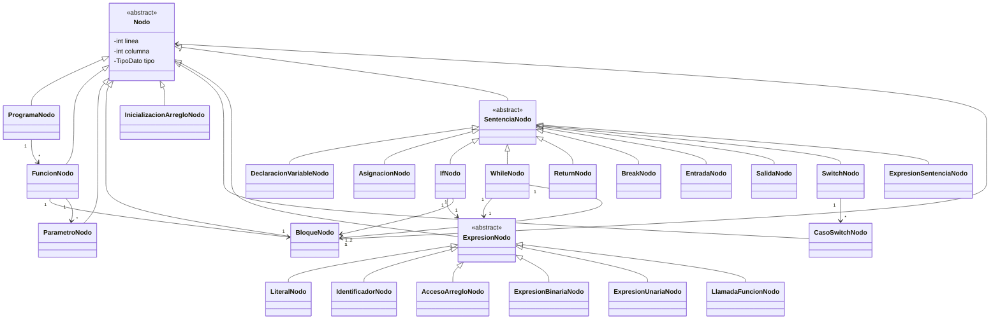

# Análisis Semántico y Generación de Código Intermedio

## Descripción
Proyecto de compiladores enfocado en validaciónes semanticas y generación de código intermedio sobre una base JFlex/CUP/Java.

## Objetivo
Practicar fases posteriores de un compilador: reglas semanticas, tablas y representaciónes intermedias.

## Tecnologías utilizadas
- Java
- Maven
- JFlex
- CUP

## Funcionalidades principales
- Especificacion lexica
- Especificacion sintactica
- Build Maven
- Punto de entrada Java

## Mi rol
Organicé el proyecto Maven y trabajé en la conexión entre análisis léxico, sintáctico y semántico.

## Aprendizajes clave
- Pipeline de compilación
- Integracion JFlex/CUP
- Validaciónes semanticas
- Automatización con Maven

## Instalación y ejecución
```bash
cd Analisis-Semantico-y-Generacion-de-Codigo-Intermedio/programa
mvn clean package
java -jar target/proyecto-compiladores-1.0-SNAPSHOT.jar
```
Si el JAR cambia de nombre, revisar `target/`.

## Estructura del proyecto
- programa/pom.xml: configuración
- programa/src/léxico/: JFlex
- programa/src/sintáctico/: CUP
- programa/src/java/Main.java: entrada
- programa/src/java/ast/: jerarquia de nodos del AST

## Diseño del AST
El AST se modela con una raiz abstracta `Nodo`, que concentra `linea`, `columna` y `TipoDato tipo`. El tipo queda inicializado como `DESCONOCIDO` cuando todavia no hay informacion semantica suficiente, y se completara durante el analisis semantico del P2/M1.



## Capturas o demo
Por documentar. Se recomienda agregar capturas de la pantalla principal o un GIF corto de uso.

## Estado del proyecto
Proyecto académico en evolución.

## Valor técnico demostrado
Demuestra comprensión de fases de compiladores y herramientas de generación.

## Mejoras futuras
- Agregar casos de prueba
- Documentar gramática
- Completar ejemplos de código intermedio

## Autor
Geovanni González  
Estudiante de Ingeniería en Computación  
GitHub: [Geovanni-Gonzalez](https://github.com/Geovanni-Gonzalez)


