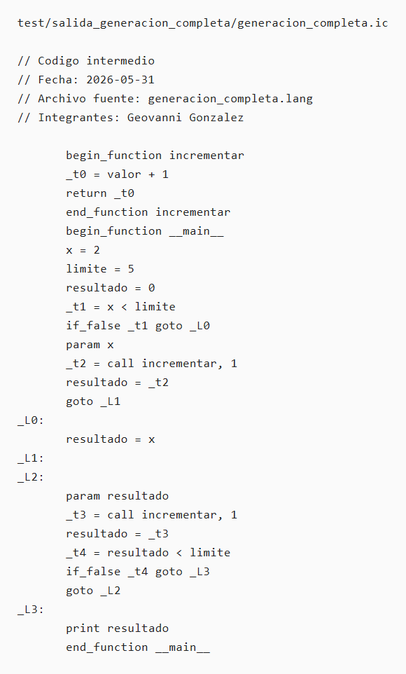

# Prueba E2E de generacion completa

Este caso verifica que un programa fuente con declaracion de variables, asignacion,
if-else, ciclo `do-while`, llamada a funcion y `return` genera codigo intermedio
sin errores y que la traza manual del `.ic` conserva el resultado observable.

Archivo fuente probado: `test/generacion_completa.lang`

Comando usado:

```bash
cd programa
java -jar target/proyecto-compiladores-1.0-SNAPSHOT.jar ../test/generacion_completa.lang ../test/salida_generacion_completa
```

El reporte `test/salida_generacion_completa/errores_report.txt` indica:

```text
ERRORES LEXICOS
Sin errores lexicos.

ERRORES SINTACTICOS
Sin errores sintacticos.

ERRORES SEMANTICOS
Sin errores semanticos.
```

## Codigo intermedio generado

Archivo generado: `test/salida_generacion_completa/generacion_completa.ic`



## Traza manual

Programa fuente:

- `incrementar(valor)` retorna `valor + 1`.
- `__main__` inicializa `x = 2`, `limite = 5` y `resultado = 0`.
- Como `x < limite` es `2 < 5`, ejecuta el bloque `if` y asigna
  `resultado = incrementar(x) = 3`.
- El ciclo `do-while` incrementa `resultado` al menos una vez y continua
  mientras `resultado < limite`.
- La salida final es `cout <|resultado|>`.

Traza del `.ic`:

```text
x = 2
limite = 5
resultado = 0
_t1 = x < limite          -> true
resultado = call incrementar(2) -> 3

_L2, iteracion 1:
resultado = call incrementar(3) -> 4
_t4 = resultado < limite  -> 4 < 5, true
goto _L2

_L2, iteracion 2:
resultado = call incrementar(4) -> 5
_t4 = resultado < limite  -> 5 < 5, false
goto _L3

print resultado            -> imprime 5
```

## Resultado

La ejecucion manual del codigo de tres direcciones termina con
`resultado = 5` y emite `print resultado`, por lo que el valor observable es
`5`. El programa fuente tambien imprime `5` despues del `if-else`, el ciclo
`do-while`, la llamada a `incrementar` y el `return`; por tanto, el `.ic`
generado es semanticamente equivalente para este caso.
