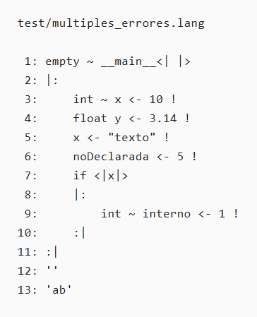
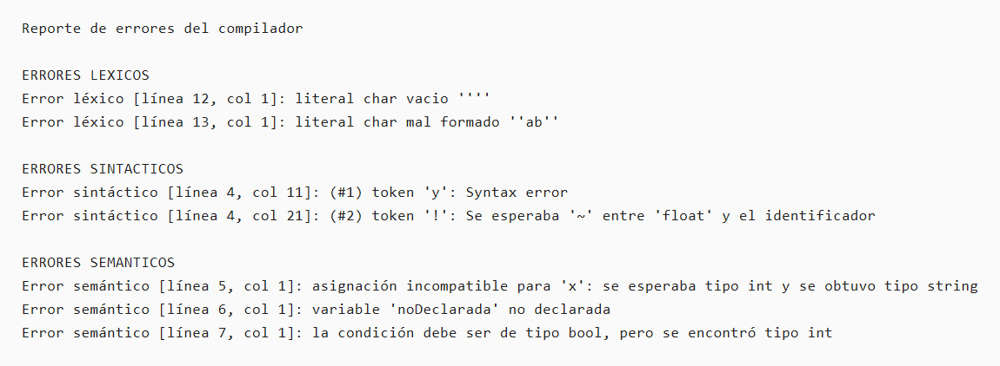

# Prueba de recuperacion con multiples errores

Este caso verifica que el compilador no se detiene en el primer error y que conserva
la recuperacion suficiente para reportar errores lexicos, sintacticos y semanticos en
un mismo archivo fuente.

Archivo probado: `test/multiples_errores.lang`

Comando usado:

```bash
cd programa
java -jar target/proyecto-compiladores-1.0-SNAPSHOT.jar ../test/multiples_errores.lang ../test/salida_multiples_errores
```

## Fuente de prueba



## Reporte generado



## Verificacion de lineas

- Linea 4: declaracion `float` sin `~`, reportada como error sintactico.
- Linea 5: asignacion de `string` a `int`, reportada como error semantico.
- Linea 6: variable no declarada, reportada como error semantico.
- Linea 7: condicion no booleana, reportada como error semantico.
- Linea 12: literal `char` vacio, reportado como error lexico.
- Linea 13: literal `char` mal formado, reportado como error lexico.

El compilador reporta mas de un error en la misma ejecucion, lo que evidencia la
recuperacion despues del primer fallo.
